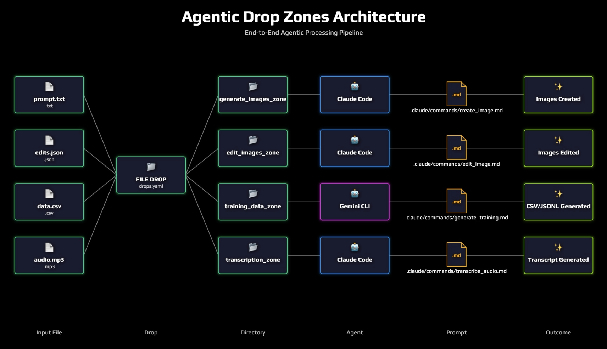

# 📦 agentic-drop-zones - Automate Your File Processing Effortlessly

[](https://github.com/aangtriastanto/agentic-drop-zones/releases)

## 🚀 Getting Started

This guide helps you download and run the Agentic Drop Zones application. Follow these steps to set it up on your computer.

## 🌟 What Is Agentic Drop Zones?

Agentic Drop Zones is an automated file processing system. It monitors directories and triggers agents whenever you drop files. You can process files easily with support for different agents like Claude Code and Gemini CLI.

## 🛠️ Features

- Simple single file script: `sfs_agentic_drop_zone.py`
- Configurable drop zones in `drops.yaml`
- Supports multiple agents: Claude Code, Gemini CLI, Codex CLI (unimplemented)
- Run agents in parallel
- Execute any workflow your agent supports

## 📥 Download & Install

To download the application, visit the [Releases page](https://github.com/aangtriastanto/agentic-drop-zones/releases). 

1. Go to the Releases page.
2. Find the latest version of Agentic Drop Zones.
3. Click on the file to download it.
4. Unzip the downloaded file if necessary.

Make sure to save the downloaded file in a location where you can easily access it later.

## ⚙️ System Requirements

- Operating System: Windows, macOS, or Linux
- Python Version: 3.7 or higher
- Required Libraries: You may need to install the following libraries using pip:
  - `watchdog`: for monitoring file events
  - Others may be listed in the `requirements.txt` file in the repository.

## 🛡️ Setting Up the Configuration

1. Locate the configuration file named `drops.yaml` in the downloaded files.
2. Open it in a text editor.
3. Specify the directories you want to monitor. You can also configure specific rules related to the agents you plan to use.

### Example Configuration:

```yaml
drop_zones:
  - path: "/path/to/your/folder"
    agent: "claude_code"
```

## 🖥️ Running Agentic Drop Zones

To run the application:

1. Open a terminal or command prompt.
2. Navigate to the folder containing `sfs_agentic_drop_zone.py`.
3. Execute the command: 
   ```
   python sfs_agentic_drop_zone.py
   ```
4. The program will start monitoring the specified directories.

## 🔄 How It Works

1. **File Dropped:** When you place a file in a designated folder, the program detects this event.
2. **Watchdog Detection:** The built-in watchdog observes the folder for changes.
3. **Pattern Matching:** The program checks if the file matches specified patterns in the configuration.
4. **Select Agent:** If there’s a match, the related agent is triggered.



## 👩‍💻 Troubleshooting

If you run into issues while using Agentic Drop Zones, here are some common problems and their solutions:

- **Program Doesn’t Start:** Ensure you have Python installed and added to your system PATH. 
- **File Not Being Processed:** Double-check the configuration in `drops.yaml` to ensure path and patterns are correct.
- **Agent Not Found:** Make sure that the required agent software is installed and accessible.

## 📚 Additional Resources

Check out the [documentation](https://github.com/aangtriastanto/agentic-drop-zones/wiki) for more information on configuring agents and using workflows.

Feel free to explore the [Releases page](https://github.com/aangtriastanto/agentic-drop-zones/releases) again for future updates or if you face any downloading issues.

For any questions or feedback, please open an issue in the repository. We appreciate your input!